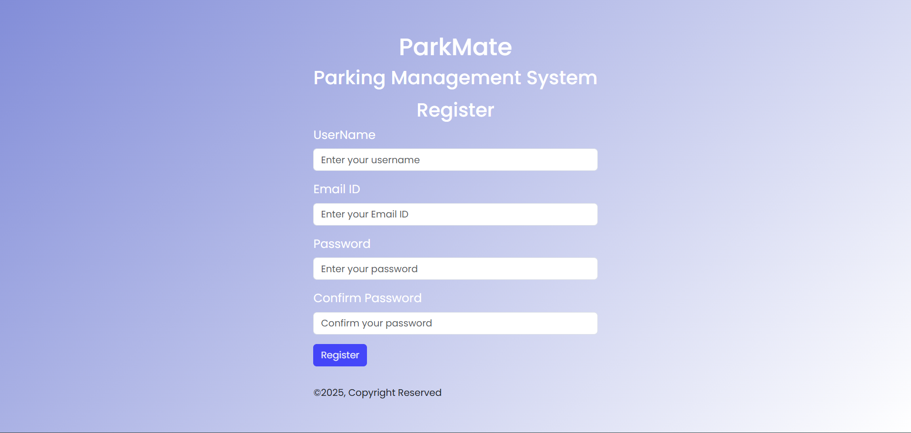
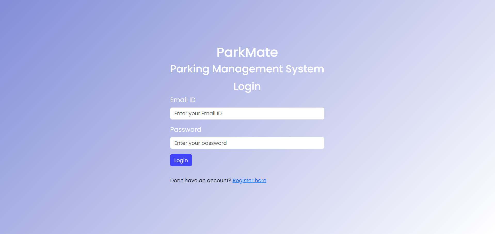
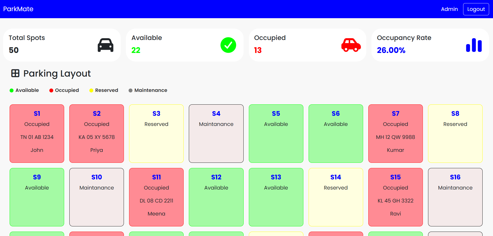
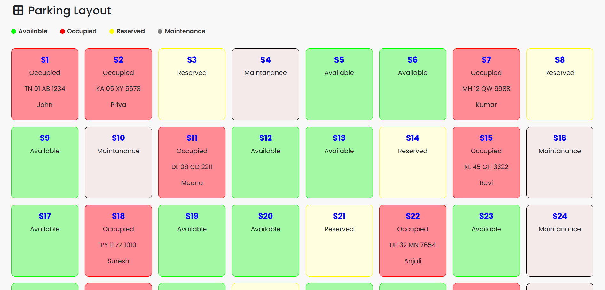
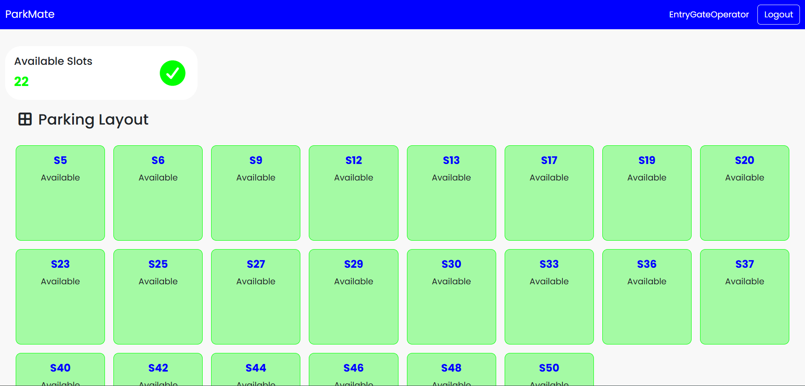
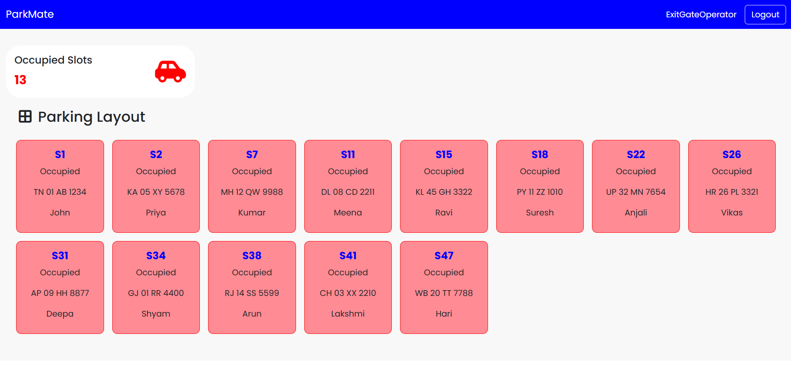
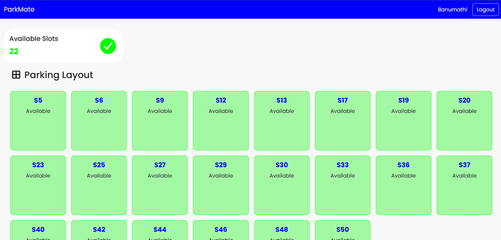
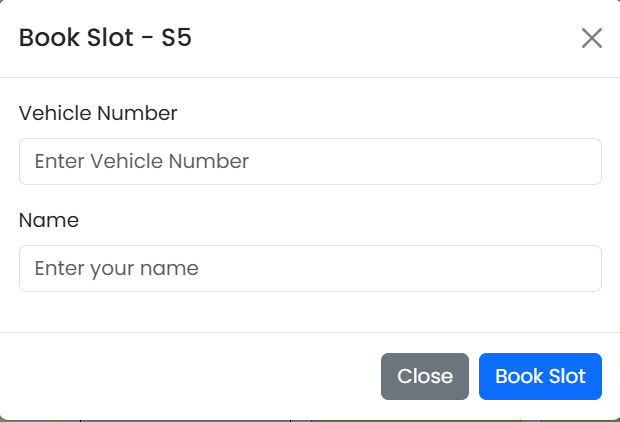
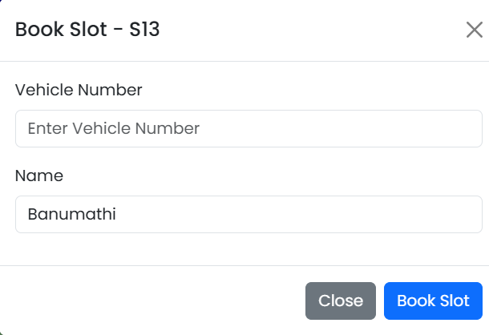

# 🚗 ParkMate – Role-Based Vehicle Parking Management System

## 📖 Overview
**ParkMate** is a role-based vehicle parking management system designed to simplify parking operations for organizations and public parking facilities.  
The system supports multiple user roles with different levels of access and functionality:
- **Admin**: Manage parking slots, view reports, oversee users.
- **Entry Gate Operator**: Register vehicles entering the parking facility.
- **Exit Gate Operator**: Process vehicle exits.
- **User**: View available slots and book parking.

ParkMate provides real-time updates on parking availability, occupancy rate, and ensures smooth coordination between entry and exit operations.

## 🛠️ Features by Role

### 👨‍💼 Admin
- Manage the entry and exit of the vehicles
- View occupancy statistics (available, occupied, reserved, under maintenance).
- Ensure real-time updates to the slot availability.

### 🚦 Entry Gate Operator
- Park a vehicle by assigning it to an available slot.
- Capture vehicle details (number, type, entry time).
- Ensure real-time updates to the slot availability.

### 🏁 Exit Gate Operator
- Process vehicle exit operations.
- Unpark slots and mark them available again.

### 👤 User
- View available parking slots.
- Book parking slots.
- Unpark the parked vehicle.
- Check slot status in real time.

## 📸 Screenshots

*Register Page*

*Login Page*

*Admin Dashboard*

*Admin Parking Layout*

*Entry Gate Operator Dashboard*

*Exit Gate Operator Dashboard*

*User Dashboard*

*Admin - Park Vehicle*

*Admin - Unpark Vehicle*

*User - Park Vehicle*

## ⚙️ Installation Guide

1. **Clone the Repository**:

-    git clone https://github.com/banumathimuthumariappan-gif/Vehicle-Parking-Management.git
-    cd Vehicle-Parking-Management

2. **Install Dependencies**:

- npm install

3. ** Run the Application**:

- ng serve
- Open in browser: http://localhost:4200/

## 🧪 Tech Stack

- Angular
- HTML
- CSS
- JavaScript
- Bootstrap
- Font Awesome Icons

## 📄 License & Credits
This project is open source. You are free to use, modify, and distribute it.

## Author
Made with ❤️ by Banumathi Muthumariappan

